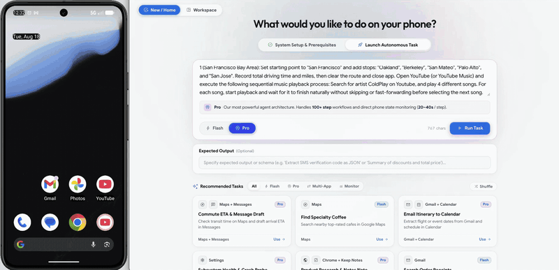
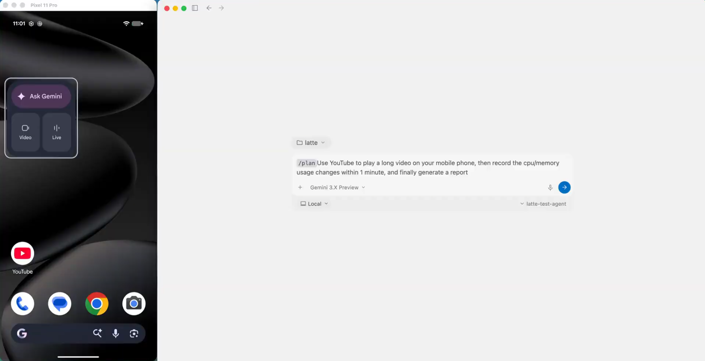
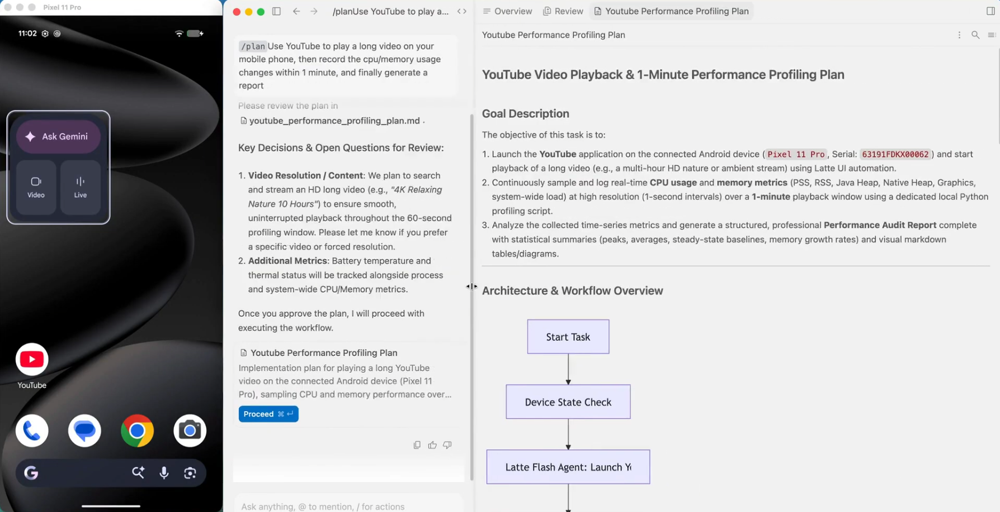
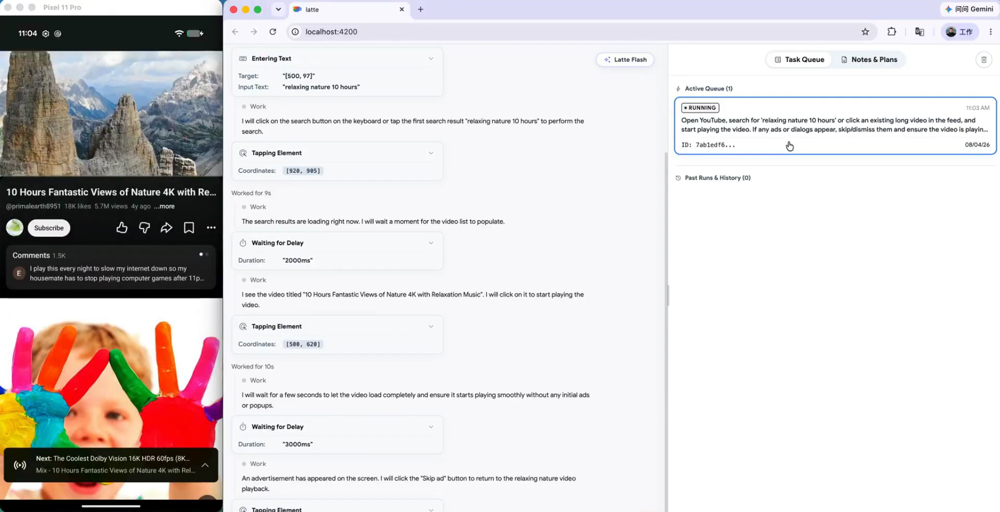
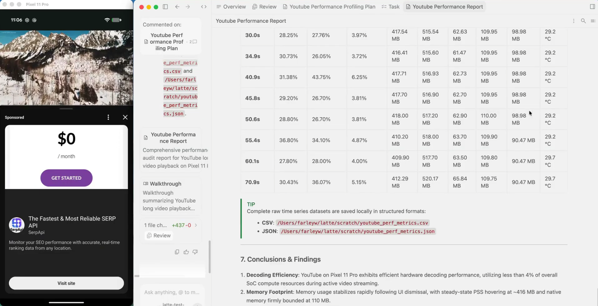
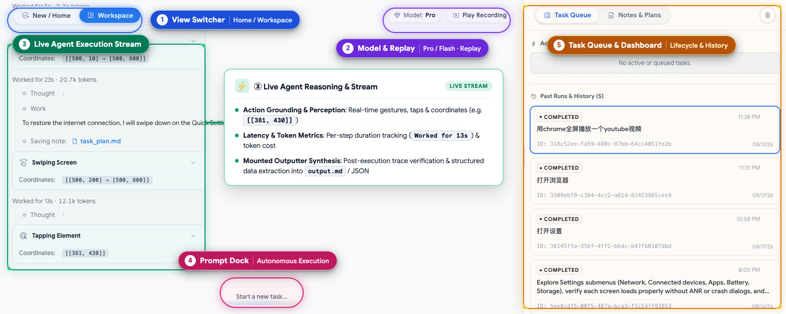
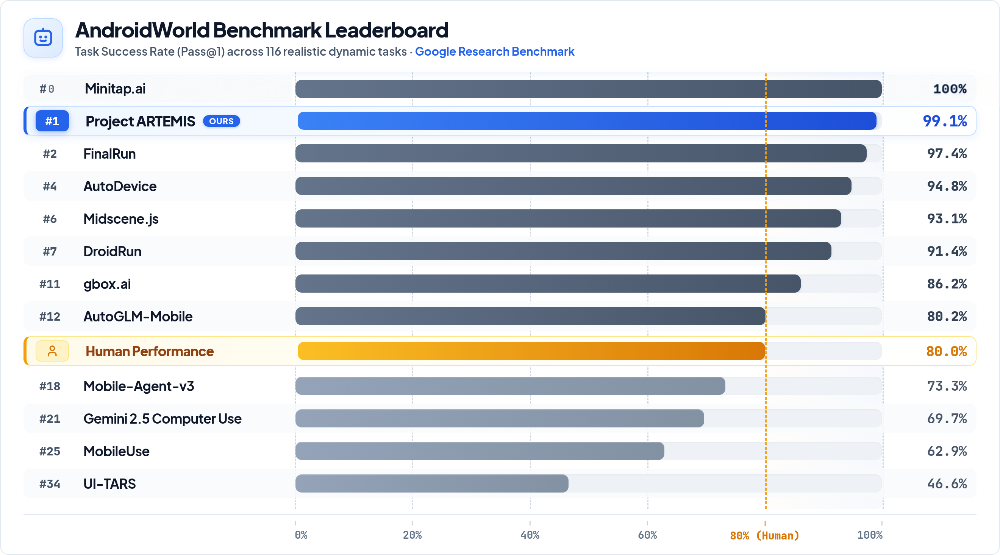
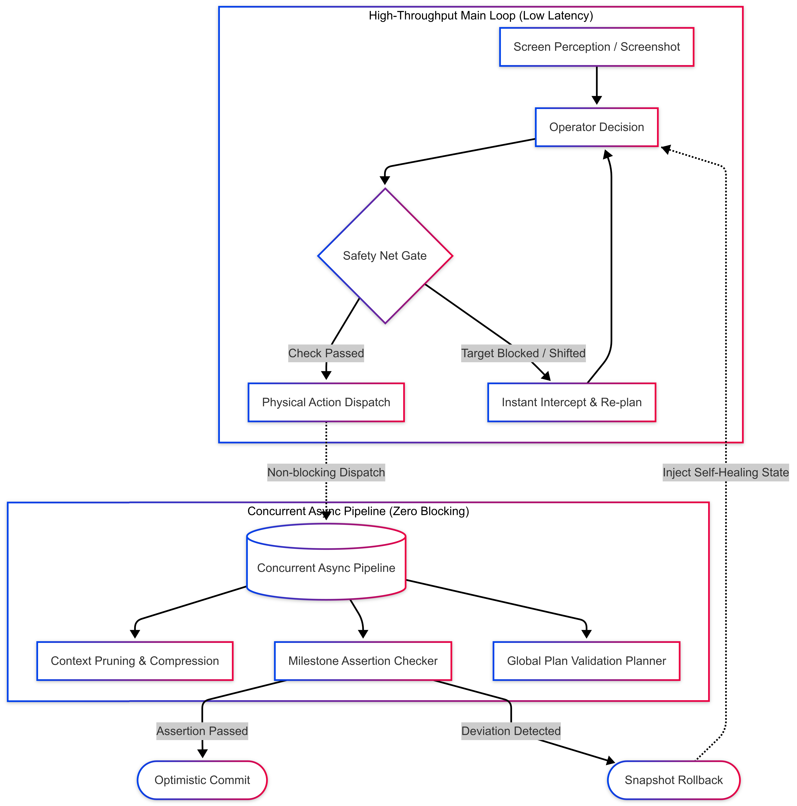

<p align="center">
  
</p>

<p align="center">
  <strong>ARTEMIS: Next-Gen AI Mobile Test Automation & Autonomous Assistant Platform</strong><br>
  <sub><b>A</b>utonomous <b>R</b>eal-time <b>T</b>esting, <b>E</b>xploration &amp; <b>M</b>obile <b>I</b>nteraction <b>S</b>ystem</sub>
</p>

<p align="center">
  <em>⚡ Drive Real Devices from Antigravity & Claude Code • Cross-App Automation • Zero-Maintenance UI Testing • Bug Repro & Logcat Diagnostics</em>
</p>

<p align="center">
  <a href="./README.md"><b>English</b></a> •
  <a href="./README_CN.md">中文文档</a> •
  <a href="#workflow-showcase">Workflow Showcase</a> •
  <a href="#quick-start">Quick Start</a> •
  <a href="#mcp-setup">MCP for IDEs</a> •
  <a href="#benchmarks">Benchmarks</a> •
  <a href="https://discord.gg/wF2FN4WHGY">Discord Community</a>
</p>

<p align="center">
  <a href="https://www.python.org/downloads/"></a>
  <a href="LICENSE"></a>
  <a href="https://modelcontextprotocol.io/"></a>
  <a href="https://ai.google.dev/"></a>
  <a href="https://github.com/google-research/android_world"></a>
</p>

<!-- Demo Showcase -->
<p align="center">
  
  <br>
  <em><b>Live Demo</b>: Setup driving routes and calculate total durations in Google Maps, then open YouTube to play a Coldplay song.</em>
</p>

## ✨ Key Highlights

* 🤖 **Cross-App Automation & Autonomous AI Assistant**: Operates not just as a robust testing framework, but as an autonomous agent capable of handling complex cross-app workflows and daily tasks via natural language;
* 🧪 **Zero-Maintenance UI Test Automation**: Built upon a "Dynamic-First, Coordinate-Fallback" multimodal locating engine, eliminating fragile XPath/ID selector maintenance and remaining resilient to UI redesigns, system updates, and resolution drift;
* 🐞 **One-Click Bug Repro & Logcat Diagnostics in IDE**: Native **Model Context Protocol (MCP)** integration allows **Antigravity, Claude Code, and Windsurf** to drive physical test devices via natural language, automatically capturing crash stacks from **Logcat** and keyframe screenshots;
* ⚡ **Ultra-Fast Execution (3–5s per Step)**: Pioneered an **Optimistic Asynchronous Pipeline** that completely decouples UI interaction from heavy LLM reasoning, achieving rapid regression throughput in Flash mode;
* 🛡️ **Popup Self-Healing & 10+ Hour Exploration**: Proprietary **Safety Net** double-checks targets before action execution to intercept and clear interfering system popups; Pro mode supports **10+ hours** of continuous exploratory & monkey-plus stability testing;
* 🏆 **Industry-Leading SOTA**: Achieved **99%+ task completion** on Google Research's **AndroidWorld** benchmark (100+ complex multi-step tasks).

<a id="workflow-showcase"></a>
## 🤝 Antigravity × ARTEMIS: Autonomous Testing Workflow

Experience seamless collaboration between **Antigravity** and **ARTEMIS** via native MCP integration — taking you from a natural language requirement to a production-grade diagnostic report in four automated steps:

<table width="100%">
  <tr>
    <td width="50%" align="center">
      <b>1️⃣ Prompt Input (Task Dispatch)</b><br>
      <sub>Describe your test scenario and target metrics in Antigravity</sub><br><br>
      
    </td>
    <td width="50%" align="center">
      <b>2️⃣ Test Plan Generation</b><br>
      <sub>Antigravity formulates a step-by-step test plan & architecture for review</sub><br><br>
      
    </td>
  </tr>
  <tr>
    <td width="50%" align="center">
      <b>3️⃣ Autonomous Test Execution</b><br>
      <sub>ARTEMIS drives the real device, navigates UI, and profiles performance</sub><br><br>
      
    </td>
    <td width="50%" align="center">
      <b>4️⃣ Comprehensive Final Report</b><br>
      <sub>Delivers structured audit findings, metric tables, and raw datasets</sub><br><br>
      
    </td>
  </tr>
</table>

<a id="quick-start"></a>
## ⚡ Quick Start

Ensure an Android device (with **USB Debugging** enabled) or emulator is connected.

```bash
# 1. Clone repo & navigate to directory
git clone https://github.com/google/artemis.git && cd artemis

# 2. One-click launch (automatically installs ADB, scrcpy, FFmpeg, uv runtime, and opens console)
# 🍎 macOS & 🐧 Linux
./start.sh

# 🪟 Windows (CMD / PowerShell)
start.bat
```

> 💡 **Tip**: Opens `http://localhost:8000` in your default browser with a device connection wizard, live screen mirroring, prompt sandbox, and execution replays. You can also run directly from CLI: `artemis run "Open Settings, find Battery and tell me current level" --profile flash`.

<a id="mcp-setup"></a>
<a id="mcp"></a>
<details>
<summary><b>🔌 MCP Setup for Antigravity / Claude Code / Windsurf (Click to expand)</b></summary>

<br>

ARTEMIS includes a native **Model Context Protocol (MCP)** server. Connect your real phone directly into AI IDEs:

### 1. Generate MCP Config

Run the built-in generator to produce ready-to-use JSON configuration:

```bash
artemis mcp --generate-config antigravity
# Or generate configs for all IDEs:
artemis mcp --generate-config all
```

### 2. Copy Config to Your IDE

* **Antigravity** (MCP config file or Settings ➔ MCP Servers):
```json
{
  "mcpServers": {
    "artemis": {
      "command": "python",
      "args": ["-m", "mcp_server"],
      "cwd": "/path/to/artemis",
      "env": {
        "PYTHONUNBUFFERED": "1"
      }
    }
  }
}
```

* **Claude Desktop** (`claude_desktop_config.json`):
```json
{
  "mcpServers": {
    "artemis": {
      "command": "python",
      "args": ["-m", "mcp_server"],
      "cwd": "/path/to/artemis"
    }
  }
}
```

### 3. Prompt Your Phone in the IDE Chat
In Antigravity or Claude Code, simply prompt:
> 💬 *"Build the latest changes into an APK, install it on the connected device, open the login screen with a test account, verify if there are any unexpected popups after login, and return screenshots of the final page."*

</details>

<a id="python-sdk"></a>
<details>
<summary><b>🐍 Python SDK Integration (Click to expand)</b></summary>

<br>

Embed the mobile automation engine into your Python workflows in just a few lines:

```python
import asyncio
from artemis.interfaces.sdk import ArtemisClient


async def main():
    # Initialize client (choose "flash" for fast UI checks or "pro" for deep reasoning & self-healing)
    client = ArtemisClient(default_profile="flash")

    # Execute natural language end-to-end test case
    result = await client.run(
        "Open System Settings, go to 'Battery', verify battery percentage is displayed, and check for any crash dialogs."
    )

    # Structured assertions & execution tracing
    assert result.status == "SUCCESS", f"Test failed: {result.failure_reason}"
    print(f"✅ Test Passed! Turns: {result.turns} | Trace ID: {result.trace_id}")


if __name__ == "__main__":
    asyncio.run(main())
```

</details>

## 🕹️ Usage Modes

<p align="center">
  
  <br />
  <sub>💡 <b>Console Overview</b>: <b>① View Switcher</b> (Home / Workspace) · <b>② Model & Replay</b> (Flash/Pro status & video replay) · <b>③ Live Agent Stream</b> (Action perception, target coordinates & structured results) · <b>④ Prompt Dock</b> (Natural language dispatch) · <b>⑤ Task Queue & Dashboard</b> (Lifecycle & history)</sub>
</p>

* 🖥️ **Web Visual Test Console (`artemis ui`)**: Real-time screen projection and interactive panel, supporting natural language test dispatch, live reasoning telemetry, action trajectories, and execution replay;
* 🔌 **Native MCP Protocol (IDE Collaboration)**: Operates as a standard MCP server seamlessly integrating with **Antigravity, Claude Code, Windsurf**, etc., directly driving real devices inside the IDE to verify bugs and run test cases;
* 💻 **Developer CLI (`artemis run`)**: Direct terminal execution for automated test cases, exploratory stability inspection, or AndroidWorld benchmarks with high-fidelity structured terminal output;
* 🐍 **Python SDK**: Integrates as a standard Python library into existing automated testing frameworks (e.g., pytest) or CI/CD pipelines with strongly typed Pydantic structured outputs and assertion support.

## 📊 Head-to-Head Comparison

| Evaluation Dimension | Traditional Test Automation (Appium / Maestro) | Generic Mobile VLM Agents | **ARTEMIS ☕ (Next-Gen AI Testing)** |
| :--- | :--- | :--- | :--- |
| **Test Case Maintenance** | ❌ Fragile XPath/ID dependencies; UI changes cause test failures | ⚠️ Unreliable execution; cannot be reused as regression tests | 🧪 **Zero Maintenance**: Natural language test cases resilient to UI drift & redesigns |
| **Execution Latency & Throughput** | ⚡ Fast script execution, but extreme setup and locator debugging costs | ❌ Sluggish 20–30s per step; too slow for regression testing | ⚡ **High Throughput**: Optimistic Async Pipeline runs at 3–5s per step |
| **Popup Resilience & Self-Healing** | ❌ System popups or permissions immediately crash the script | ❌ Easily gets stuck or loops endlessly on unexpected dialogs | 🛡️ **Pre-Execution Safety Net**: Automatically intercepts and clears interfering popups |
| **Diagnostics & Multimedia** | ❌ Blind static waits (sleep); cannot assert dynamic video/animations | ❌ Static screenshots only; no system logs or underlying state | 🐞 **Deep Diagnostics**: Live video stream analysis & **Logcat crash stack capture** |
| **Dev Environment Integration** | ❌ Standalone runner; requires manual log collection upon failure | ❌ Isolated web demos; difficult to embed into dev pipelines | 🔌 **Native MCP & SDK**: Drive physical test devices and debug directly inside Antigravity / Claude Code |

<a id="benchmarks"></a>
## 🏆 Benchmarks: AndroidWorld (SOTA 99%+)

Evaluated on [AndroidWorld](https://github.com/google-research/android_world) — Google Research's gold-standard benchmark spanning 20+ real apps and 100+ complex multi-step tasks: **Artemis demonstrated exceptional robustness across the entire benchmark suite, achieving a 99%+ completion rate.**

<p align="center">
  
</p>

## 🚀 How ARTEMIS is Architected

* ⚡ **Optimistic Asynchronous Pipeline**: The front-facing loop responds in milliseconds, while memory pruning and assertion verification run concurrently in the background without blocking execution;
* 🛡️ **Safety Net Pre-Execution Gate**: Dual-layer pre-check validates target availability milliseconds before action dispatch, instantly intercepting unexpected popups to eliminate blind clicks;
* ⏱️ **Time-Sensitive Speculative Chaining**: Overcomes LLM inference latency for transient UI elements (e.g. video fullscreen) by predicting target coordinates and executing rapid chained taps.

<details>
<summary><b>🔍 Click to expand: Architecture Deep Dive & Pipeline Diagram</b></summary>

<br>

### 1. ⚡ Optimistic Asynchronous Pipeline
* **Status Quo & Pain Points**: Conventional mobile agents rely on a **fully synchronous blocking model** — every single action must wait sequentially for the LLM to prune historical context, check milestone assertions, and audit long-term plans. This inflates per-step latency to 20–40 seconds, creating a sluggish user experience.
* **Artemis's Architectural Solution**: Inspired by **Optimistic Concurrency Control (OCC) and Snapshot Isolation** in database systems, Artemis completely decouples the main execution loop from heavy auxiliary computation:
  * **High-Throughput Main Loop**: The front-facing execution path is strictly narrowed to a high-speed "Perception → Decision → Safety Gate → Execution" pipeline;
  * **Background Concurrent Tasks**: Context token pruning, milestone checkers (`Checker`), and planner validations (`Planner`) run dynamically in parallel without halting device interaction;
  * **Snapshot Isolation & Rollback**: The agent optimistically charges forward. If background verification detects a deviation, Artemis instantly **rolls back via state snapshots (Rollback)** and injects self-healing feedback.

<p align="center">
  
</p>

### 2. 🛡️ Pre-Execution Safety Net & Time-Sensitive Speculative Chaining
* **Status Quo & The Transient UI Dilemma**:
  * Mobile applications feature numerous **time-sensitive transient UI controls** (e.g. video fullscreen: tapping the screen wakes up the floating overlay, followed immediately by tapping the fullscreen icon).
  * Traditional agents tap the screen to reveal controls, take a new screenshot, and wait 3–15 seconds for LLM reasoning. By the time the click is dispatched, **the player controls have already auto-faded away** — causing the click to strike the underlying video, triggering an endless loop of accidental pausing and waking.
* **Artemis's Architectural Solution**:
  * **Speculative Chained Actions**: Upon recognizing time-sensitive dependencies, the agent dispatches compound chained actions (Wakeup → Millisecond Chained Tap) to hit the target within its transient visibility window;
  * **Two Pillars Ensuring Reliable Chaining**:
    1. **Historical UI Prior Prediction**: Predicts the target control's wake-up coordinates based on prior interaction history and app layout heuristics;
    2. **Safety Net Pre-Execution Gate**: Milliseconds before the chained action lands, the Safety Net instantly verifies that the target control was successfully revealed at the expected coordinates. If the wakeup failed or an unexpected popup intercepted it, execution is **immediately blocked to prevent blind clicks**.

</details>

## ⚡ Execution Profiles: Flash vs. Pro

| Feature / Dimension | ⚡ **ARTEMIS Flash** (`--profile flash`) | 🧠 **ARTEMIS Pro** (`--profile pro`) |
| :--- | :--- | :--- |
| **Design Purpose** | **Lightweight & Fast**: Direct deterministic UI actions | **Deep Reasoning**: Multi-step planning & complex self-healing |
| **Step Latency** | **3–5 seconds** / step | **15–30 seconds** / turn (includes planning & verification) |
| **Task Duration** | Minute-level short tasks (typically ≤35 steps) | Runs stably for **10+ hours**; monitoring tasks support **24/7 execution** |
| **Best Suited For** | Well-defined standard UI tasks | Complex cross-app workflows, failure self-healing, continuous monitoring |
| **Self-Healing** | Local step retries | **Safety Net Gate** + dialog suppression + crash recovery + snapshot rollback |
| **Media Analysis** | **Basic visual perception** + High-Speed OCR | Full `scrcpy`/`ffmpeg` video stream analysis + Logcat logs |

## 🗺️ Roadmap

- [x] **Optimistic Asynchronous Pipeline**: Ultra-lean main loop + background context compression & milestone checks.
- [x] **Pre-Execution Safety Net**: Millisecond pre-check gate & speculative chained actions.
- [x] **Time-Sensitive Media Tasks**: Fullscreen video and audio stream analysis with `scrcpy` & `ffmpeg`.
- [x] **Native MCP Server**: Seamless integration with tools like Antigravity and Claude Desktop.
- [x] **Web Visual Console**: Live screen projection, interactive playground, and trajectory review.
- [x] **AndroidWorld SOTA**: Achieved 99%+ task completion rate.
- [ ] **Cross-Platform Extensions**: Exploring iOS and desktop Web perception and execution.
- [ ] **On-Device Lightweight VLMs**: Zero-cloud local execution with lightweight edge vision models.
- [ ] **Real-time Duplex Voice Mode**: Natural voice input with real-time interruption (barge-in) control.

## 🤝 Community & Contributing

Contributions are warmly welcomed!
* ⭐ **Star the repo** to follow updates and releases
* 💬 Join the [Discord Community](https://discord.gg/wF2FN4WHGY) for technical discussions
* 🐛 Open an [Issue](https://github.com/google/artemis/issues) or submit a [Pull Request](https://github.com/google/artemis/pulls)

## 📄 License

This project is licensed under the [Apache License 2.0](LICENSE).
