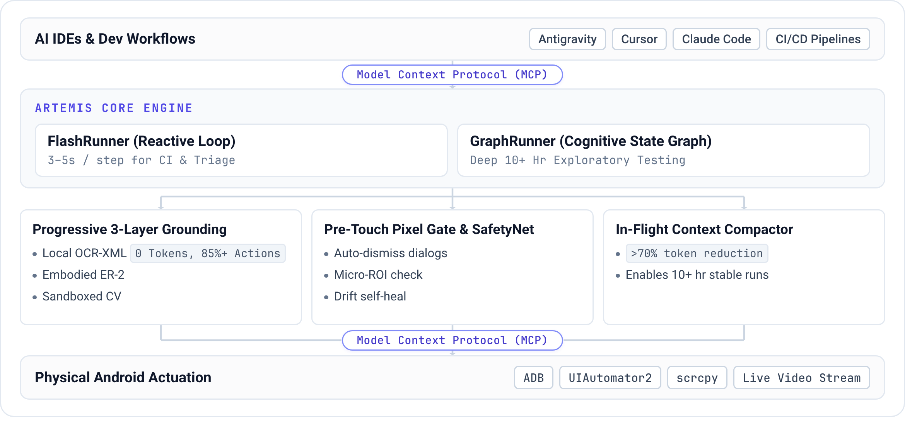

<p align="center">
  
</p>

<p align="center">
  <strong>AI 어시스턴트와 테스트 스위트가 사람처럼 실제 폰을 직접 조작하게 하세요.</strong>
</p>

<p align="center">
  <a href="./README.md">English</a> •
  <a href="./README_CN.md">中文文档</a> •
  <a href="./README_KR.md"><b>한국어</b></a> •
  <a href="#workflow-showcase">워크플로우 쇼케이스</a> •
  <a href="#quick-start">빠른 시작</a> •
  <a href="#mcp-setup">IDE용 MCP 설정</a> •
  <a href="#benchmarks">벤치마크</a> •
  <a href="https://discord.gg/wF2FN4WHGY">Discord 커뮤니티</a>
</p>

<p align="center">
  <a href="https://www.python.org/downloads/"></a>
  <a href="LICENSE"></a>
  <a href="https://modelcontextprotocol.io/"></a>
  <a href="https://ai.google.dev/"></a>
  <a href="https://github.com/google-research/android_world"></a>
</p>

<!-- 데모 쇼케이스 -->
<p align="center">
  
  <br>
  <em>실기 데모: Google Maps에서 운전 경로를 설정하고 총 소요 시간을 계산한 뒤, YouTube를 열어 Coldplay 노래를 재생합니다.</em>
</p>

## 핵심 특징

* **크로스 앱 자동화**: 자연어 지시만으로 Android에서 테스트 워크플로우와 일상 작업을 실행합니다.
* **멀티모달 타겟팅**: 가능한 경우 요소 인덱스를 우선 사용하고, 커스텀 UI에서는 좌표 및 비주얼 인식으로 대체합니다.
* **IDE 내 진단**: **Model Context Protocol (MCP)** 연동으로 **Antigravity, Claude Code, Windsurf**가 테스트 기기를 직접 조작하고 **Logcat** 출력과 스크린샷을 수집합니다.
* **Flash 실행**: 비동기 히스토리 요약을 곁들인 반응형 관찰-실행 루프로, 스텝당 보통 **3~5초**가 걸립니다.
* **Pro 탐색**: 개별 액션 실행 전에 타겟을 검증하고, 차단된 액션은 Operator에게 돌려보내 복구를 시도합니다. 장시간 탐색 및 안정성 테스트를 지원합니다.
* **AndroidWorld 결과**: Google Research의 **AndroidWorld** 벤치마크(100개 이상의 멀티스텝 작업)에서 **99% 이상의 작업 완료율**을 달성했습니다.

<a id="workflow-showcase"></a>
## Antigravity × ARTEMIS: 자율 테스트 워크플로우

**Antigravity**는 MCP를 통해 **ARTEMIS**를 사용하여 테스트 요청을 계획, 기기 실행, 진단 리포트로 전환합니다:

<table width="100%">
  <tr>
    <td width="50%" align="center">
      <b>1. 프롬프트 입력 (작업 전달)</b><br>
      <sub>Antigravity에 테스트 시나리오와 목표 지표를 설명합니다</sub><br><br>
      
    </td>
    <td width="50%" align="center">
      <b>2. 테스트 계획 생성</b><br>
      <sub>검토를 위한 단계별 테스트 계획과 아키텍처를 수립합니다</sub><br><br>
      
    </td>
  </tr>
  <tr>
    <td width="50%" align="center">
      <b>3. 자율 테스트 실행</b><br>
      <sub>실기를 직접 조작해 UI를 탐색하고 성능을 프로파일링합니다</sub><br><br>
      
    </td>
    <td width="50%" align="center">
      <b>4. 최종 리포트</b><br>
      <sub>구조화된 감사 결과, 지표 표, 원본 데이터셋을 제공합니다</sub><br><br>
      
    </td>
  </tr>
</table>

<a id="quick-start"></a>
## 빠른 시작

**USB 디버깅**이 활성화된 Android 기기 또는 에뮬레이터가 연결되어 있는지 확인하세요. 원클릭 시작 스크립트가 자동으로 다음을 수행합니다:
- **시스템 툴체인 설치**: ADB, scrcpy, FFmpeg, Python(`uv`) 의존성을 감지하고 자동 설치합니다.
- **전역 MCP 서버 및 AI 에이전트 규칙 마운트**: 전역 MCP 설정과 **Artemis 모바일 테스트 마인드셋(`rules.md`)**을 사용 중인 AI IDE(**Antigravity**, **Cursor**, **Claude Code**, **Codex**, **Windsurf**, **VS Code**, **Cline/Roo**, **OpenClaw**)에 자동 설치할지 묻습니다.

### macOS 및 Linux

```bash
# 1. 저장소 클론 후 디렉터리 이동
git clone https://github.com/google/artemis.git && cd artemis

# 2. 원클릭 실행
./start.sh
```

### Windows PowerShell

```powershell
# 1. 저장소 클론 후 디렉터리 이동
git clone https://github.com/google/artemis.git
cd artemis

# 2. 원클릭 실행
.\start.bat
```

> PowerShell은 기본적으로 현재 디렉터리에서 실행 스크립트를 찾지 않으므로, 끝에 `\`를 붙이지 말고 `.\start.bat`처럼 사용하세요. 기존 명령 프롬프트(CMD)에서는 `start.bat`을 사용하면 됩니다.

> **팁**: 기본 브라우저에서 `http://localhost:8000`을 열어 기기 연결 마법사, 실시간 화면 미러링, 프롬프트 샌드박스, 실행 리플레이를 제공합니다. CLI에서 바로 실행할 수도 있습니다: `uv run artemis run "설정을 열고 배터리를 찾아 현재 잔량을 알려줘" --profile flash`.

<a id="mcp-setup"></a>
<a id="mcp"></a>
<details>
<summary><b>Codex / Antigravity / Claude Code / Windsurf용 MCP 설정 (클릭해서 펼치기)</b></summary>

<br>

ARTEMIS는 네이티브 **Model Context Protocol (MCP)** 서버를 내장하고 있습니다. 실제 폰을 AI IDE에 바로 연결해보세요:

### 1. 원클릭 자동 설치 (권장)

`./start.sh`(macOS/Linux) 또는 `.\start.bat`(Windows PowerShell)을 실행하면 감지된 IDE에 대해 전역 MCP와 테스트 규칙 설정 여부를 물어봅니다 (아래 명령으로 언제든 수동으로 설치/업데이트할 수도 있습니다):

```bash
# Antigravity / Jetski용 MCP 서버 및 전역 규칙 자동 설치:
uv run artemis mcp --install antigravity

# 또는 지원되는 모든 AI IDE에 설치 (Codex 포함):
uv run artemis mcp --install all
```

> **팁**: `uv run artemis init`으로 최초 설정을 진행하는 동안 대화형으로 MCP를 구성할 수도 있습니다.
> **프로 팁**: 모든 디렉터리에서 `uv run` 없이 전역으로 `artemis` 명령을 쓰고 싶다면, 프로젝트 루트에서 `uv tool install -e .`을 한 번 실행하세요.

### 2. 수동 설정 (선택)

수동으로 설정하려면 `uv run artemis mcp --generate-config <client>`(예: `codex` 또는 `antigravity`)를 실행해 해당하는 TOML 또는 JSON 스니펫을 출력하세요. `/path/to/artemis`를 실제 저장소 경로로 바꾸고 `command`는 `.venv` 안의 Python 실행 파일을 가리키도록 설정합니다:

* **Codex** (`~/.codex/config.toml`):
```toml
[mcp_servers.artemis]
command = "/path/to/artemis/.venv/bin/python"
args = ["-m", "mcp_server"]
cwd = "/path/to/artemis"

[mcp_servers.artemis.env]
PYTHONUNBUFFERED = "1"
PYTHONPATH = "/path/to/artemis"
```

* **Antigravity** (`~/.gemini/jetski/mcp_config.json`):
```json
{
  "mcpServers": {
    "artemis": {
      "command": "/path/to/artemis/.venv/bin/python",
      "args": ["-m", "mcp_server"],
      "cwd": "/path/to/artemis",
      "env": {
        "PYTHONUNBUFFERED": "1"
      },
      "tools": {
        "mobile_run_task": { "eager": true },
        "mobile_manage_task": { "eager": true },
        "mobile_get_device_state": { "eager": true },
        "mobile_inspect_trace": { "eager": true },
        "mobile_diagnose": { "eager": true }
      }
    }
  }
}
```

* **Claude Desktop** (`claude_desktop_config.json`):
```json
{
  "mcpServers": {
    "artemis": {
      "command": "/path/to/artemis/.venv/bin/python",
      "args": ["-m", "mcp_server"],
      "cwd": "/path/to/artemis"
    }
  }
}
```

### 3. AI 에이전트용 행동 규칙 마운트하기 (강력 추천)

AI 코딩 어시스턴트가 숙련된 모바일 테스트 엔지니어처럼 신중하게 동작하고 UI 상호작용을 함부로 추측하지 않도록, 전용 테스트 마인드셋 규칙 파일을 [`mcp_server/rules.md`](./mcp_server/rules.md)에서 제공합니다 (**코딩 전 능동 탐색**, **Flash vs. Pro 라우팅 전략**, **지연 및 타이밍 보정**, **"동적 우선, 좌표 폴백" 로케이터 패턴**을 다룹니다).

[`mcp_server/rules.md`](./mcp_server/rules.md)를 AI IDE의 규칙 설정에 마운트하거나 복사해 넣을 수 있습니다:
* **Antigravity**: `rules.md`의 내용을 Workspace Rules, Global Rules 설정 또는 에이전트 지침에 추가합니다.
* **Claude Code**: `artemis mcp --install claude`를 실행하면 규칙이 `~/.claude/rules/artemis.md`에 설치됩니다 (정확히 한 위치에만 설치하세요 — Claude Code는 `~/.claude/CLAUDE.md`와 `~/.claude/rules/*.md`를 모두 로드하므로, 중복 설치는 컨텍스트를 낭비합니다).
* **Cursor**: 내용을 `.cursorrules`에 복사하거나 `.cursor/rules/artemis.mdc` 규칙 파일을 새로 만듭니다.
* **Codex**: 내용을 `~/.codex/AGENTS.md`(또는 활성화된 `AGENTS.override.md`)에 추가합니다.
* **Windsurf / OpenClaw**: 워크스페이스 규칙이나 전역 시스템 프롬프트에 규칙을 추가합니다.

> 테스트 마인드셋과 MCP 아키텍처에 대한 더 자세한 내용은 [MCP Server README](./mcp_server/README.md)를 참고하세요.

### 4. IDE 채팅창에서 폰에 프롬프트 보내기
Codex, Antigravity, Claude Code에서 다음처럼 입력해보세요:
> *"최신 변경 사항을 APK로 빌드해서 연결된 기기에 설치하고, 테스트 계정으로 로그인 화면을 연 뒤, 로그인 후 예상치 못한 팝업이 있는지 확인하고, 최종 화면 스크린샷을 보여줘."*

</details>

<a id="python-sdk"></a>
<details>
<summary><b>Python SDK 연동 (클릭해서 펼치기)</b></summary>

<br>

런타임 의존성이 없는 클라이언트를 개발 머신에 설치하세요. ADB, 에이전트, 모델, 이미지 처리는 모두
디바이스 호스트 쪽에 남아 있습니다:

```powershell
uv add "artemis-client @ git+https://github.com/google/artemis.git#subdirectory=packages/artemis-client"
```

```python
import asyncio
from artemis_client import ArtemisClient


async def main():
    client = ArtemisClient(
        "http://artemis-host:8000",
        device_serial="emulator-5554",  # 선택 사항: 특정 기기 시리얼 지정
        default_profile="flash",  # "flash"(빠른 반응형) 또는 "pro"(심층 추론)
    )

    result = await client.run(
        "시스템 설정을 열고 'Battery'로 이동해 배터리 퍼센트가 표시되는지 확인하고, 충돌 다이얼로그가 있는지 확인해줘.",
    )

    assert result.succeeded, f"테스트 실패: {result.error or result.status}"
    print(f"✅ 테스트 통과! Device: {result.device_serial} | Trace ID: {result.trace_id}")


if __name__ == "__main__":
    asyncio.run(main())
```

</details>

## 사용 모드

<p align="center">
  
  <br />
  <sub><b>콘솔 개요</b>: <b>① 뷰 전환</b>(Home / Workspace) · <b>② 모델 및 리플레이</b>(Flash/Pro 상태 및 비디오 리플레이) · <b>③ 실시간 에이전트 스트림</b>(액션 인식, 타겟 좌표, 구조화된 결과) · <b>④ 프롬프트 독</b>(자연어 작업 전달) · <b>⑤ 작업 큐 및 대시보드</b>(생명주기 및 히스토리)</sub>
</p>

* **웹 비주얼 테스트 콘솔 (`uv run artemis ui`)**: 실시간 화면 투사와 인터랙티브 패널을 제공하며, 자연어 테스트 전달, 실시간 추론 텔레메트리, 액션 궤적, 실행 리플레이를 지원합니다. `uv run artemis restart`, `uv run artemis stop`, `uv run artemis status`로 어느 터미널에서든 서버 생명주기를 관리할 수 있습니다.
* **MCP 서버**: **Antigravity, Claude Code, Windsurf** 등 다른 MCP 클라이언트를 실제 기기와 연결해 버그 재현 및 테스트 실행에 사용합니다.
* **개발자 CLI (`uv run artemis run`)**: 자동화된 테스트 케이스, 탐색적 안정성 점검, AndroidWorld 벤치마크를 고정밀 구조화 터미널 출력과 함께 직접 터미널에서 실행합니다.
* **Python SDK**: Pydantic 기반의 강타입 구조화 출력과 assertion 지원으로, 기존 자동화 테스트 프레임워크(예: pytest)나 CI/CD 파이프라인에 표준 Python 라이브러리로 통합됩니다.

<a id="on-device-helper"></a>
## ARTEMIS가 폰에 설치하는 것

기기에서 처음 실행되는 작업은 **Artemis Accessibility Helper**를 설치합니다. 이는 UiAutomation 연결을 점유하지 않고
화면 레이아웃을 읽는 작은 접근성 서비스입니다. UiAutomation을 사용하는 도구는 `FLAG_DONT_SUPPRESS_ACCESSIBILITY_SERVICES`를
활성화하지 않으면 이 헬퍼를 억제할 수 있습니다. 접힌 형태의 "Artemis test helper is running" 알림과
설정 > 접근성의 새 항목이 보이는데, 둘 다 이 헬퍼입니다. 이 헬퍼는 폰 안에서만 동작하며 어디로도 데이터를 전송하지 않습니다.

* 미리 설치하기(첫 작업 시 발생하는 약 3초 지연을 방지): `uv run artemis helper install`
* 상태 확인: `uv run artemis helper status` / `uv run artemis doctor`
* 언제든 제거: `uv run artemis helper uninstall`
* 대신 UIAutomator2 사용: `.env`에 `ARTEMIS_HIERARCHY_BACKEND=uiautomator` 설정
* 자동 설치 방지: `.env`에 `ARTEMIS_HELPER_AUTO_INSTALL=false` 설정

작업 도중 헬퍼가 실패하면 ARTEMIS는 UIAutomator2로 폴백하며, 작업 타임라인과 `mobile_manage_task` 상태, 최종 리포트에
그 사실을 명시합니다.

<a id="benchmarks"></a>
## 벤치마크: AndroidWorld (SOTA 99%+)

Artemis는 20개 이상의 앱과 100개 이상의 멀티스텝 작업을 아우르는 Google Research의 벤치마크
[AndroidWorld](https://github.com/google-research/android_world)에서 **99% 이상의 완료율**을 달성했습니다.

<p align="center">
  
</p>

## ARTEMIS의 아키텍처

* **실행 전 검증 및 액션 버스트**: Pro는 개별 액션을 전송하기 전에 실시간 UI 트리와 픽셀을 기준으로 타겟을 검증합니다. 액션 버스트는 다음 모델 턴을 기다리지 않고 일시적인 컨트롤을 처리합니다.
* **요소 인식**: 접근성 계층 구조와 OCR을 비전 모델과 결합해 커스텀 Canvas, Compose, Flutter 인터페이스를 지원합니다.
* **공유 히스토리 압축**: Flash와 Pro는 오래된 스크린샷을 비주얼 요약으로 대체하고, 완료된 스텝을 검색 가능한 히스토리 청크로 압축합니다. 컨텍스트 임계값이 원본 턴을 언제 대체할지 결정합니다.

<p align="center">
  
</p>

## 실행 프로필: Flash vs. Pro

ARTEMIS는 서로 다른 자동화 요구에 맞춘 두 가지 실행 프로필을 제공합니다:

* **Flash 프로필 (`--profile flash`)**: 빠르고 토큰 효율적인 반응형 루프(스텝당 약 3~5초)로, 그래프 오케스트레이션 없이 하나의 모델이 실시간 화면을 관찰하고, 생각하고, 실행합니다. 반복적이고 결정적인 UI 작업에 적합합니다. 기본적으로 루프 스텝 수 제한이 없습니다(`agent.flash.max_turns`, 0 = 무제한). 히스토리가 잘리지 않고 압축되기 때문입니다: Flash는 Pro와 세션 트랜스크립트 원장을 공유하며(세션 상대 `T+mm:ss` 클록, 스크린샷을 비주얼 요약으로 접기, 오래된 스텝을 시대별로 청크화해 `search_history` / `replay_steps`로 필요할 때 조회 가능), `video_analyzer`로 세션 녹화를 조회할 수도 있습니다. 일시적인 UI(자동으로 사라지는 컨트롤 바, 토스트 등)는 여러 탭을 하나의 `click_sequence`로 묶어서 만료되기 전에 처리합니다. *제약 사항*: 작업 계획이나 노트 없음, 실행 전 안전망 없음, 체크포인트 검증이나 최종 리포트 없음, ADB 셸 없음.
* **Pro 프로필 (`--profile pro`)**: 다중 에이전트 그래프로 구성된 계획 및 검증 워크플로우(스텝당 약 15~40초)입니다. **Planner**는 마일스톤과 `verify` / `assert` 체크 항목이 담긴 살아있는 Markdown 작업 계획을 유지합니다. **Operator**는 전체 도구 세트(사용자 설정으로 지정되는 `flash` / `pro` / `ultra` 인식 깊이의 Explorer 그라운딩 — `config/artemis.jsonc`의 `pro.explorer.mode` / `flash.explorer_mode` 또는 `--explorer-pro-mode`로 지정하며, 에이전트가 스스로 선택하지 않습니다 — 노트, 히스토리 조회, 비디오 분석, ADB 진단)로 계획을 실행합니다. 모든 개별 액션은 실행 전 **Safety Net**(XML 우선, 픽셀 폴백)을 통과하며, 다중 액션 **패스트 액션 버스트(fast-action burst)**는 연달아 실행되어 일시적인 UI에 대한 턴 지연을 극복합니다. 액션이 차단되거나 실패하면 **실행 인시던트(execution incident)**가 열려 이후 액션이 성공할 때까지 Operator의 컨텍스트에 남아 있으며, 복구는 별도의 복구 에이전트 없이 Operator가 스스로 판단합니다. 읽기 전용 **Checker**는 계획에 명시된 체크포인트를 감사하고 원래 목표에 대한 최종 리뷰를 종료 시점에 수행하며(`--verification-level`: `off` / `final`(기본값) / `checkpoints` / `strict`), 계획 마일스톤 수정은 권고성 검토를 받습니다. 100개 이상의 스텝으로 이어지는 장기 워크플로우, `[Loop:continuous]` 모니터링, 선택적인 서면 리포트를 지원합니다.

## 로드맵

- [ ] **Android Studio 통합**: 네이티브 IDE 플러그인과 워크플로우 통합으로 Android Studio 안에서 바로 인라인 디버깅, 테스트 기록, 자동화된 기기 제어를 지원합니다.
- [ ] **iOS 플랫폼 확장**: 멀티모달 인식과 모바일 자동화를 iOS 기기 및 시뮬레이터로 확장합니다.
- [ ] **온디바이스 경량 VLM**: 저지연·프라이버시 우선 자동화를 위한 경량 엣지 비전 모델을 로컬에서 실행합니다.
- [ ] **실시간 듀플렉스 음성 인터랙션**: 실시간 대화형 제어와 인터럽션 처리를 지원하는 음성 기반 작업 전달.

## 커뮤니티 & 기여

기여를 언제나 환영합니다!
* **저장소에 Star**를 눌러 업데이트와 릴리스를 팔로우하세요
* 기술 논의를 위해 [Discord 커뮤니티](https://discord.gg/wF2FN4WHGY)에 참여하세요
* [Issue](https://github.com/google/artemis/issues)를 열거나 [Pull Request](https://github.com/google/artemis/pulls)를 제출해주세요

## 라이선스

이 프로젝트는 [Apache License 2.0](LICENSE)에 따라 라이선스가 부여됩니다.
