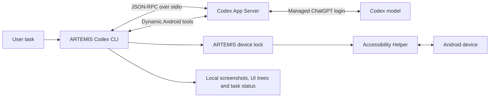

# Android tasks with a Codex ChatGPT login (experimental)

Use an existing Codex ChatGPT session to run Android tasks without configuring a
model API key in ARTEMIS. This is a separate Codex execution path, not an API-key
provider or a replacement for the Flash/Pro engines.



## Requirements

- ARTEMIS installed with `uv sync` and ADB available.
- Codex CLI on PATH (or pass `--codex-bin /path/to/codex`). The integration targets
  the app-server protocol shipped with Codex CLI **0.153.4**. Dynamic tools are an
  experimental Codex API; older versions may need an upgrade.
- A ChatGPT account with Codex access. Model availability and usage limits remain
  those of Codex and the signed-in account.
- An attached, authorized Android device. The runner uses ARTEMIS's Accessibility
  Helper, installing/enabling the bundled helper on first connection when allowed
  by the existing helper configuration. See the main README for helper management.

## Sign in and run

```sh
# Reuses an existing ChatGPT session, otherwise opens Codex's browser login.
uv run artemis codex login

# Alternative when a browser callback is unavailable:
uv run artemis codex login --device-code

# No model call; prints only authentication type and readiness.
uv run artemis codex status

adb devices -l
uv run artemis codex run "Open Settings and read the battery percentage" \
  --serial YOUR_DEVICE_SERIAL --timeout 300 --max-actions 30
```

In Windows PowerShell, write the run command on one line or use PowerShell's
backtick continuation instead of `\`.

The model defaults to the user's Codex configuration. Optionally pass `--model`
with a model available to that account. `--serial` is mandatory: the runner never
silently selects another attached phone. It fails if that device is busy or not
authorized.

No credentials are copied into `.env`. Codex owns login persistence and token
refresh via its official app-server account API. The integration does not read
`auth.json`, extract OAuth tokens, or call private ChatGPT endpoints. It rejects
API-key authentication and removes `OPENAI_API_KEY`/`CODEX_API_KEY` from its child
process environment to avoid accidentally selecting API billing. An existing
API-key login is not automatically replaced by `status` or `run`; use the explicit
`login` command to switch to ChatGPT.

For a proxy setup, configure the Codex process's network access as usual and keep
localhost traffic out of HTTP proxies (`NO_PROXY=localhost,127.0.0.1`), since the
phone helper communicates through a local ADB forward.

## What the runner does

1. Starts an owned app-server process over stdio and checks `account/read`.
2. Acquires the existing ARTEMIS per-device execution lock and connects the helper.
3. Starts an ephemeral Codex thread in a temporary directory with validated
   `android_observe`, `android_tap`, `android_swipe`, `android_type`, and
   `android_key` tools. It disables configured MCP servers and host shell,
   browser, computer, plugin, hook, and multi-agent features for that thread.
   The Codex host sandbox is read-only; device actions are executed by ARTEMIS
   under the user's explicit Android task, outside that host filesystem sandbox.
4. Sends the user task and processes dynamic tool requests. Each action requires
   an unconsumed observation ID, expires observations after 60 seconds, checks
   coordinate bounds, and consumes an action budget. Unexpected server requests
   terminate the run rather than implicitly approving them.
5. Stores screenshots, UI XML, `codex-actions.jsonl`, and the existing ARTEMIS
   `status.json` under the trace directory. These local files can contain phone
   content and typed text; review them before sharing a bug report.
6. Interrupts unfinished Codex turns on timeout/cancellation and releases the
   device lock and helper connection.

`--timeout` limits the Codex turn after setup; individual helper/ADB operations
also have their own bounded timeouts. A synchronous device call already in
progress finishes or times out before cancellation releases the device lock.

Exit status is 0 only when Codex reports `succeeded: true` and a final observation
was taken after the last action. A completed Codex turn alone does not mark the
Android task successful. Failure exits 1; Ctrl+C exits 130. The result includes
the trace path, action count, and observation count.

## Scope of this first integration

- CLI only: Web UI, daemon scheduling, batch, and `mobile_run_task` still use their
  existing Flash/Pro paths and provider configuration.
- Screenshots and UI trees are sent to Codex. This is not offline inference.
- No arbitrary ADB shell, app installation, video analysis, automatic screen
  recording, Pro plan/checkpoint verification, or Flash/Pro history compression.
- The result is Codex's self-reported assessment, with a required final screen
  observation; it is not an independent verification by Pro's Checker.
- A fresh screenshot ID reduces stale-action mistakes but does not guarantee the
  screen stayed unchanged between observation and execution.

## Validation

The deterministic suite needs neither Codex nor a phone:

```sh
uv run pytest tests/unit/test_codex_integration.py
```

For a live smoke test, sign in, attach a test phone, and run the battery example
above. Check that screenshots and action records exist and compare the reported
percentage with the final screen. Also test Ctrl+C and device disconnection;
subsequent ARTEMIS tasks must be able to acquire the device again.

Official references:

- [Codex authentication](https://developers.openai.com/codex/auth)
- [Codex app-server](https://developers.openai.com/codex/app-server)
